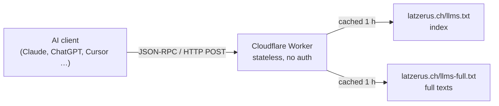

<div align="center">


# Latzerus MCP Server

**Swiss B2B sales and everyday-AI know-how — inside your AI assistant.**
113 free 5-minute learning modules from [latzerus.ch](https://www.latzerus.ch), one endpoint, no account.

[](https://registry.modelcontextprotocol.io/v0/servers?search=ch.latzerus)
[](https://modelcontextprotocol.io)
[](https://modelcontextprotocol.io/docs/concepts/transports)
[](#-privacy--safety)
[](https://www.latzerus.ch/lernen/)
[](https://smithery.ai/servers/cllatzi/latzerus-mcp)
[](https://glama.ai/mcp/connectors/ch.latzerus/lernbereich)
<!-- Offizielles Smithery-Badge — einsetzen, sobald smithery.ai/badge wieder ausliefert (liefert Stand 2026-09-18 HTTP 500):
[](https://smithery.ai/servers/cllatzi/latzerus-mcp) -->

```
https://mcp.latzerus.ch/mcp
```

</div>

---

## What this is

Latzerus is the knowledge project of **Christoph Latzer** (St. Gallen / Zurich, Switzerland): over a
hundred short, field-tested lessons on B2B selling, on using AI at work without handing your data away,
and on career positioning. *Smart not hard — help people help themselves.*

This server puts that library one question away. Ask your assistant *"how do I answer «too expensive»?"*
and it reads the actual module instead of guessing.

> 🇩🇪 The modules are written in German. The tools are named in German too — your assistant handles that.

**Free, read-only, no sign-up, no API key, no cookies.** It runs as a single Cloudflare Worker that reads
the site's public `llms.txt` and `llms-full.txt` — there is no database and no user data anywhere in it.

## 🛠 Tools

| Tool | What it does |
|---|---|
| `lernmodule_suchen` | Keyword search across all modules → title, cluster, URL, summary, relevance score. Understands paraphrases, synonyms, singular/plural and typos — you don't need the exact wording of a title. Returns `structuredContent`, so clients don't have to parse prose. |
| `lernmodul_lesen` | One module in full: key points, main part, practical steps, typical mistakes, FAQ. Takes the slug or the URL. |
| `lernmodule_uebersicht` | All modules grouped by theme. Optional `cluster` parameter to fetch just one theme and save tokens. |
| `ueber_latzerus` | Background on the project, the four themes, the tools used, and contact details. |

The four themes: **Vertrieb & Kommunikation** (43) · **KI im Arbeitsalltag** (42) ·
**Karriere-Werkstatt** (21) · **Wilde Themen** (7).

## 🎯 What people use it for

- **Cold calling & closing** — argumentation frameworks, objection handling («too expensive», «we already
  have a supplier», «I'll get back to you»), and how to ask for the order without begging for it.
- **AI without the data leak** — what belongs in a cloud model and what doesn't, GDPR/DSG-aware workflows,
  and setting up local models with Ollama, from «which machine do I need» to a RAG chatbot on your own handbook.
- **Career positioning** — honest self-assessment, reading job ads the way HR means them, and a USP that
  survives contact with reality. No buzzwords.

## 🚀 Connect it

### Claude Desktop / Claude.ai
Settings → **Connectors** → **Add custom connector** → Name `Latzerus`, URL `https://mcp.latzerus.ch/mcp`.
Leave OAuth client ID and secret empty.

### Claude Code
```bash
claude mcp add --transport http latzerus https://mcp.latzerus.ch/mcp
```

### Cursor — `.cursor/mcp.json`
```json
{
  "mcpServers": {
    "latzerus": {
      "url": "https://mcp.latzerus.ch/mcp"
    }
  }
}
```

### VS Code — `.vscode/mcp.json`
```json
{
  "servers": {
    "latzerus": {
      "type": "http",
      "url": "https://mcp.latzerus.ch/mcp"
    }
  }
}
```

### Smithery
```bash
npx -y smithery mcp add cllatzi/latzerus-mcp
```
The server is also listed on [Smithery](https://smithery.ai/servers/cllatzi/latzerus-mcp), which offers a
proxied endpoint (`https://latzerus-mcp--cllatzi.run.tools`) and a CLI to browse the tools:
`npx -y smithery tool list cllatzi/latzerus-mcp`.

### AnythingLLM, Open WebUI, LM Studio, ChatGPT
Step-by-step with copy-paste snippets: **[latzerus.ch/mcp](https://www.latzerus.ch/mcp/)**.
(AnythingLLM needs `"type": "streamable"`. The paths `/sse` and `/see` do not exist — the endpoint is `/mcp`.)

### Try it without a client
```bash
curl -s https://mcp.latzerus.ch/mcp \
  -H 'Content-Type: application/json' \
  -d '{"jsonrpc":"2.0","id":1,"method":"tools/call",
       "params":{"name":"lernmodule_suchen","arguments":{"suchbegriff":"Kunde will billiger"}}}'
```

## ⚙️ How it works



The site publishes its own content as `llms.txt` and `llms-full.txt`; the worker parses those on the fly,
so a new module is searchable the moment it is online. Nothing is duplicated, nothing gets stale.

**Search, in short:** queries and index are normalised the same way (umlauts, stemming), matched by exact
token, prefix and a one-edit typo tolerance, expanded through 45 hand-kept synonym classes, then scored by
field — title counts six times as much as body text — with a coverage factor and a relevance threshold, so
a weak match disappears under a clear one. Full texts are only pulled in when the keyword pass finds too
little. Typical search: **70–115 ms**.

Discovery: [`/.well-known/mcp/server.json`](https://mcp.latzerus.ch/.well-known/mcp/server.json) ·
listed in the official MCP Registry as **`ch.latzerus/lernbereich`**.

## 📦 This repository

| File | |
|---|---|
| `worker.js` | the whole server — one file, no dependencies, no build step. Paste it into the Cloudflare dashboard and deploy. |
| `mcp-eval.mjs` + `mcp-eval-set.json` | 34 search cases with expected results (`--live` runs them against the deployed server). Run before every deploy. |
| `mcp-smoke.mjs` | handshake, all four tools, error codes and edge cases — offline, against the worker file. |
| `mcp-volltext-check.mjs` | does every module have its anchor in `llms-full.txt`? |
| `mcp-lesen-check.mjs` | calls `lernmodul_lesen` for every slug and verifies it returns the right module. |
| `CHANGELOG.md` | what changed and when. |

```bash
node mcp-eval.mjs          # search quality, local logic against the live index
node mcp-smoke.mjs         # protocol, tools, error handling
node mcp-eval.mjs --live   # same 34 cases against https://mcp.latzerus.ch/mcp
```

Requires Node 22+. No install, no dependencies.

## 🔒 Privacy & safety

Read-only by design: the four tools return text, nothing else. No authentication, because there is nothing
to authenticate — every byte it serves is public on latzerus.ch anyway. No cookies, no tracking, no
logging of what you ask. It cannot touch anything on your machine.

## 📜 License & attribution

The **content** of the learning modules belongs to Christoph Latzer. Reading, quoting and summarising it is
explicitly welcome — please name the source:

> Christoph Latzer, Latzerus — https://www.latzerus.ch/

The **code** in this repository is MIT licensed (see `LICENSE`). *Latzerus* is a registered Swiss trademark
(Swissreg CH 817140); the licence covers the code, not the name or the logo.

---

<div align="center">

**[latzerus.ch](https://www.latzerus.ch)** · [All modules](https://www.latzerus.ch/lernen/) ·
[Setup guide](https://www.latzerus.ch/mcp/) · [Contact](https://www.latzerus.ch/contact/)

<sub>A knowledge project from Eastern Switzerland. Smart not hard · Pareto · Help people help themselves · the 5-minute rule.</sub>

</div>
